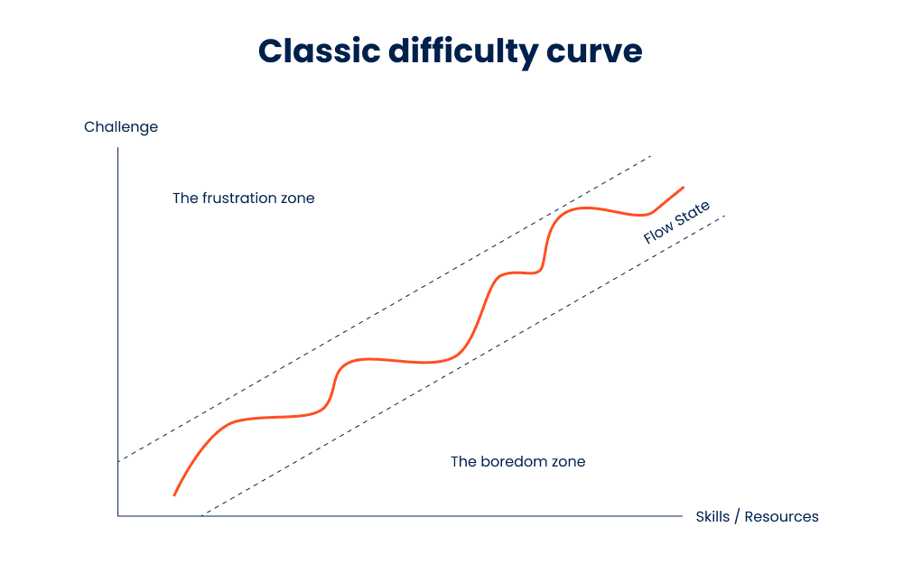
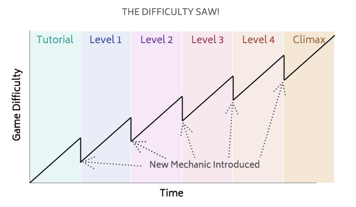

# Theory of flow:

- Skill
- Challenge
- Boredom
- Anxiety
- Flow
 
- dolezite: nech vzdy po bossfighte ide narocnost docasne dolu (nech to je lahsie nech ten boss) - cas na oddych. Cize nie ze vsetky NPC za bossom budu zrazu na urovni ako je ten boss.

